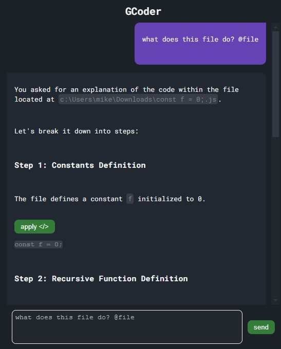

<!-- Based on: https://github.com/othneildrew/Best-README-Template/blob/main/README.md?plain=1 -->

<!-- PROJECT SHIELDS -->

[![Contributors][contributors-shield]][contributors-url]
[![Forks][forks-shield]][forks-url]
[![Stargazers][stars-shield]][stars-url]
[![Issues][issues-shield]][issues-url]
[![MIT License][license-shield]][license-url]
[![LinkedIn][linkedin-shield]][linkedin-url]

<!-- PROJECT LOGO -->
 

  <h3 align="center">GCoder</h3>

  

    VS code AI assistant
     
    <a href="https://github.com/Altair200333/GCoder">View Demo</a>
    ·
    <a href="https://github.com/Altair200333/GCoder/issues/new?labels=bug&template=bug-report---.md">Report Bug</a>
    ·
    <a href="https://github.com/Altair200333/GCoder/issues/new?labels=enhancement&template=feature-request---.md">Request Feature</a>
  

<!-- ABOUT THE PROJECT -->

## About The Project

This is very minimalistic vs code extension aimed to replace most fun Cursor AI features, that requires only custom OpenAI **API key**

#### What it is, and will be?

- [x] Reference active file, ask questions about it
- [x] Apply code block from response to local file (as github diff view)
- [ ] Nice UI to reference file, N-files, current selection or nothing
- [ ] Voice input (talking to LLM can be faster then typing)
- [ ] Select model to use near text input
- [ ] Store converstations and switch between them

#### Why did I want to make this extension?

- I just wanted to enjoy cursor editor features, by providing it a custom API key (which it supports), but soon found out that my requests went into very long queue because _"they are still processed by our backend"_ as they say it
- Some features required their subscription and were limited in use (fast calls, apply code, code suggestions), but can totally be done by LLM that you pay for
- Other extensions that allow to use LLM is side-panel, dont have this level of integration, like referencing a file, or "applying" code block to the file

 
 
 
 

(<a href="#readme-top">back to top</a>)

### Screenshots

<!-- MARKDOWN LINKS & IMAGES -->
<!-- https://www.markdownguide.org/basic-syntax/#reference-style-links -->

[contributors-shield]: https://img.shields.io/github/contributors/Altair200333/GCoder.svg?style=for-the-badge
[contributors-url]: https://github.com/Altair200333/GCoder/graphs/contributors
[forks-shield]: https://img.shields.io/github/forks/Altair200333/GCoder.svg?style=for-the-badge
[forks-url]: https://github.com/Altair200333/GCoder/network/members
[stars-shield]: https://img.shields.io/github/stars/Altair200333/GCoder.svg?style=for-the-badge
[stars-url]: https://github.com/Altair200333/GCoder/stargazers
[issues-shield]: https://img.shields.io/github/issues/Altair200333/GCoder.svg?style=for-the-badge
[issues-url]: https://github.com/Altair200333/GCoder/issues
[license-shield]: https://img.shields.io/github/license/Altair200333/GCoder.svg?style=for-the-badge
[license-url]: https://github.com/Altair200333/GCoder/blob/master/LICENSE.txt
[linkedin-shield]: https://img.shields.io/badge/-LinkedIn-black.svg?style=for-the-badge&logo=linkedin&colorB=555
[linkedin-url]: https://www.linkedin.com/in/ne0ck/
[product-screenshot]: images/screenshot.png
[Next.js]: https://img.shields.io/badge/next.js-000000?style=for-the-badge&logo=nextdotjs&logoColor=white
[Next-url]: https://nextjs.org/
[React.js]: https://img.shields.io/badge/React-20232A?style=for-the-badge&logo=react&logoColor=61DAFB
[React-url]: https://reactjs.org/
[Vue.js]: https://img.shields.io/badge/Vue.js-35495E?style=for-the-badge&logo=vuedotjs&logoColor=4FC08D
[Vue-url]: https://vuejs.org/
[Angular.io]: https://img.shields.io/badge/Angular-DD0031?style=for-the-badge&logo=angular&logoColor=white
[Angular-url]: https://angular.io/
[Svelte.dev]: https://img.shields.io/badge/Svelte-4A4A55?style=for-the-badge&logo=svelte&logoColor=FF3E00
[Svelte-url]: https://svelte.dev/
[Laravel.com]: https://img.shields.io/badge/Laravel-FF2D20?style=for-the-badge&logo=laravel&logoColor=white
[Laravel-url]: https://laravel.com
[Bootstrap.com]: https://img.shields.io/badge/Bootstrap-563D7C?style=for-the-badge&logo=bootstrap&logoColor=white
[Bootstrap-url]: https://getbootstrap.com
[JQuery.com]: https://img.shields.io/badge/jQuery-0769AD?style=for-the-badge&logo=jquery&logoColor=white
[JQuery-url]: https://jquery.com
